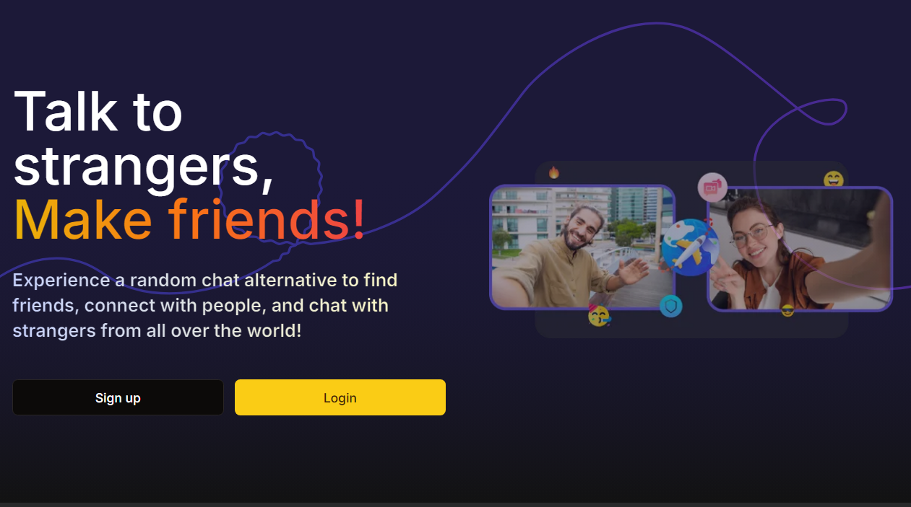
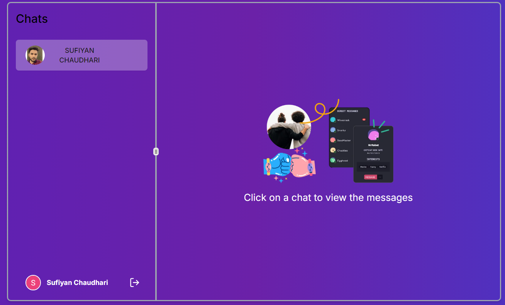

# ChatApp: Real-time Chat Application



ChatApp is a modern, feature-rich chat application built with cutting-edge technologies to provide a seamless and engaging user experience.

## Features

- Real-time messaging
- User authentication
- Rich media sharing
- Responsive design
- Customizable user profiles
- Sound notifications
- Animated UI elements

## Tech Stack

ChatApp is built using the following technologies:

- [Next.js](https://nextjs.org/) with TypeScript
- [Redis](https://redis.io/) for caching and real-time data storage
- [shadcn/ui](https://ui.shadcn.com/) for beautiful, accessible UI components
- [Pusher](https://pusher.com/) for real-time websocket communication
- [Cloudinary](https://cloudinary.com/) for image and media management
- [Framer Motion](https://www.framer.com/motion/) for smooth animations
- [Tailwind CSS](https://tailwindcss.com/) for responsive styling
- [Zustand](https://github.com/pmndrs/zustand) for state management
- [useSound](https://github.com/joshwcomeau/use-sound) for audio feedback
- [Kinde](https://kinde.com/) for secure authentication

## Getting Started



### Prerequisites

- Node.js (v14 or later)
- npm or yarn
- Redis server

### Installation

1. Clone the repository:

   ```
   git clone https://github.com/iamsufiyan560/Next.JS-Chat.git
   cd ChatApp
   ```

2. Install dependencies:

   ```
   npm install
   # or
   yarn install
   ```

3. Set up environment variables:
   Create a `.env.local` file in the root directory and add the following variables:

   ```
   KINDE_CLIENT_ID=
   KINDE_CLIENT_SECRET=
   KINDE_ISSUER_URL=
   KINDE_SITE_URL=
   KINDE_POST_LOGOUT_REDIRECT_URL=
   KINDE_POST_LOGIN_REDIRECT_URL=

   UPSTASH_REDIS_REST_URL=
   UPSTASH_REDIS_REST_TOKEN=

   NEXT_PUBLIC_CLOUDINARY_CLOUD_NAME=
   NEXT_PUBLIC_CLOUDINARY_API_KEY=
   CLOUDINARY_API_SECRET=

   PUSHER_APP_ID=
   PUSHER_APP_KEY=
   PUSHER_APP_SECRET=
   PUSHER_APP_CLUSTER=

   NEXT_PUBLIC_PUSHER_APP_KEY=
   ```

4. Run the development server:

   ```
   npm run dev
   # or
   yarn dev
   ```

5. Open [http://localhost:3000](http://localhost:3000) in your browser to see the application.

## Contributing

We welcome contributions to ChatApp! Please see our [Contributing Guide](CONTRIBUTING.md) for more details.

## License

This project is licensed under the MIT License - see the [LICENSE](LICENSE) file for details.

## Acknowledgements

- [Next.js Documentation](https://nextjs.org/docs)
- [Redis Documentation](https://redis.io/documentation)
- [Pusher Channels Documentation](https://pusher.com/docs/channels)
- [Cloudinary Documentation](https://cloudinary.com/documentation)
- [Tailwind CSS Documentation](https://tailwindcss.com/docs)
- [Framer Motion Documentation](https://www.framer.com/motion/)
- [Zustand Documentation](https://github.com/pmndrs/zustand)
- [Kinde Documentation](https://kinde.com/docs/)

---

Built with ❤️ by sufiyan
